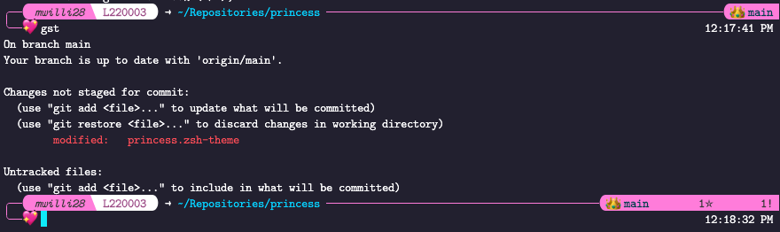

This is a ZSH themed, modeled after [abhiyan.zsh](https://github.com/abhiyandhakal/abhiyan.zsh)
with perhaps a bit too much pink and arguably too few emojis.

## Requirements

You will need to have [oh-my-zsh](https://ohmyz.sh/) installed, and your terminal
must support [powerline fonts](https://github.com/powerline/fonts) otherwise you
will be missing the glyphs used to create the rounded edges.

The font used in the example image is [Latin Modern Mono](https://www.fontsquirrel.com/fonts/latin-modern-mono),
which I found thanks to [compute cuter](https://computecuter.com) It may be a
better option to use one of the modifed fonts that powerline provides, though.
Vscode's terminal emulator handles Latin Modern Mono just fine, but
iTerm2 doesn't like to play well with this theme right now.

## Installation

This can be done in a variety of ways. Perhaps the cleanest is to directly source
the theme from your `.zshrc`, but the theme file can also be copied into the
themes directory of oh-my-zsh (`~/.oh-my-zsh/themes`) and then loaded by name
by setting `ZSH_THEME="princess"` in your `.zshrc`.

## ToDo
 - Fix issues with iTerm2
